# BRIGHT TUTOR PLATFORM

📧 neexg7@gmail.com | 🌐 www.neexg.com | ☎ +880 1743586381

## Enterprise Master Scope & Ecosystem Bible

**Document Type:** Master Scope Document (MSD)  
**Version:** 2.1  
**Status:** Draft for Client Approval  
**Classification:** Confidential – Client & Delivery Team  
**Last Updated:** March 2026

---

## Table of Contents

| Part  | Section    | Description                                                        |
| ----- | ---------- | ------------------------------------------------------------------ |
| **A** | 1–2        | Introduction, Scope, Product Vision & Positioning                  |
| **B** | 3          | Stakeholders, Roles, RBAC Permission Matrix, Role–Module Mapping   |
| **C** | 4          | System Design, Architecture, Tech Stack Justification, Deployment  |
| **D** | 5–9        | Module Overview, Guardian/Teacher/CRO/Admin Detailed Requirements  |
| **E** | 10–12      | Status Engine, Next Task Engine, Payment & Refund, Bonus Slabs     |
| **F** | 13–14      | User Stories (by role), User Journeys & Sequence/Flow Diagrams     |
| **G** | 15–17      | Non-Functional Requirements, Delivery Roadmap, Acceptance Criteria |
| **H** | Appendices | Glossary, References, Revision History                             |

---

## Document Control

| Attribute         | Value                                       |
| ----------------- | ------------------------------------------- |
| Document ID       | BT-MSD-2026-002                             |
| Title             | Bright Tutor – Master Scope Document        |
| Scope             | App + Web + Admin + CRO Console             |
| Owner             | Product / Delivery Lead                     |
| Stakeholders      | Client, PO, Design, Engineering, QA, DevOps |
| Supersedes        | Version 1.0 (Draft)                         |
| Approval Required | Client Sign-off                             |

---

# PART A — EXECUTIVE & STRATEGY

📧 neexg7@gmail.com | 🌐 www.neexg.com | ☎ +880 1743586381

## 1. Introduction

### 1.1 Purpose

This document is the **single source of truth** for the Bright Tutor platform. It defines:

- **End-to-end scope** (A–Z) for Guardian (Parent) Web & App, Teacher Web & App, CRO Console, and Admin Panel.
- **Stakeholders, roles, permissions** (RBAC).
- **System architecture, technology stack rationale**, and design.
- **Modules, features, and detailed requirements** (functional & non-functional).
- **User stories, user journeys, and flows** with visual diagrams.
- **Engines** (Status, Task, Payment, Refund, Bonus, Lock, Ribbon).
- **Delivery roadmap** and acceptance criteria.

It consolidates:

- Figma prototypes (Bright Tutor App, Bright Tutor Admin Panel).
- Internal specs (status engine, payment, ribbon, bonus, workflows).
- Prior scope/SRS drafts.

**Audience:** Client, Product Owners, Designers, Engineers, QA, DevOps.

### 1.3 MVP / Phase-01 – Client-Provided Integrations & Current Process

For **MVP/Phase-01**, the client will provide the following external providers and integrations. These replace the current manual process (Excel/sheets) and are required for go-live.

| Provider / Integration | Purpose | Notes |
|------------------------|---------|--------|
| **IP call provider** | Inbound/outbound calls for CRO/Manager; caller ID capture | When a guardian calls the business number, the call is received via IP; the system shall receive caller number and optionally auto-populate the tuition create form. |
| **SSLCommerz** | Payment gateway | Online payment collection (e.g. Guardian pays 7d/30d/partial via web/app). Client provides credentials and sandbox/live config. |
| **SMS provider (e.g. Teletalk)** | SMS notifications and OTP | Used for reminders, alerts, and OTP; client provides API/credentials. |
| **Others as needed** | Push, social posting, etc. | Any additional providers required for Phase-01 will be supplied or approved by the client. |

**Current state (pre-platform):** All tuition pipeline, payments, and follow-ups are handled manually in **Excel/sheets**. The platform replaces this with the CRO Console, status/task engine, and integrated payments/communications.

**Lead capture flow (inbound call → tuition creation):**

1. Guardian calls the business number (advertised number).
2. Manager/CRO receives the call **via IP call provider** (softphone or integrated dialer).
3. **Caller number is auto-populated** in the **Tuition Create** form in the Guardian field (primary phone).
4. Manager/CRO asks the guardian: **“Is this your personal number or optional (alternate)?”** and sets:
   - **Primary phone** = main contact (e.g. personal).
   - **Alternate phone** = optional/second number (if provided).
5. Manager/CRO (or designated role) fills the rest of the tuition form: student(s), class, subjects, location, schedule, salary, other requirements, etc.
6. After **all required info is filled**, the form is submitted → tuition is **Created** in the system (status **CREATED**), and the tuition enters the CRO pipeline for broadcast, shortlisting, and further steps as per the master lifecycle.

This flow ensures that every inbound lead from a phone call is captured in the platform with the correct guardian number (primary/alternate) for future call recognition and communication.

**Lead capture – sequence (high level):**

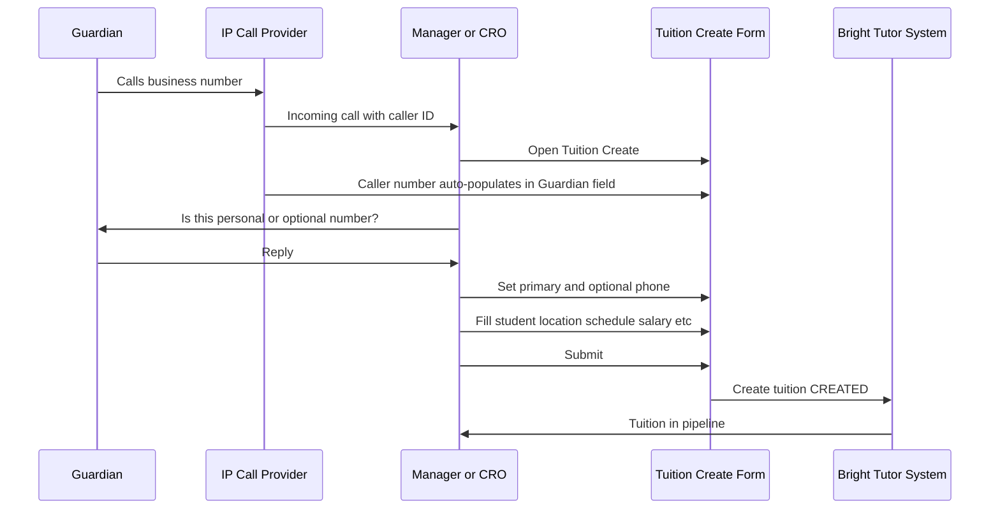

### 1.2 Scope Summary

| Category         | In Scope (Phase 1)                                                                                         | Out of Scope (Phase 1)                 |
| ---------------- | ---------------------------------------------------------------------------------------------------------- | -------------------------------------- |
| **Access**       | Authentication, RBAC, role-based UI                                                                        | —                                      |
| **Guardian**     | Tuition CRUD, shortlist view, chat (unlock), decisions, feedback, payments, refunds                        | —                                      |
| **Teacher**      | Onboarding, profile, apply/shortlist, chat, schedule, earnings, bonus view                                 | —                                      |
| **CRO**          | Pipeline, per-tuition cockpit, status/task engine, calls, SMS/app/social, payment/refund meta              | —                                      |
| **Admin**        | Config (status, protocols, payment, refund, bonus, lock), user/role management, analytics, refund approval | —                                      |
| **Engines**      | Status, Next Task, Time Protocols, Payment, Refund, Bonus, Lock, Ribbon, Notifications                     | Full AI matching, predictive scoring   |
| **Integrations** | SMS (e.g. Teletalk), Push, In-App, Social posting; **IP call provider** (client-provided); **SSLCommerz** (client-provided) | Full external CRM, ERP                 |
| **Data**         | Real-time sync Web + Apps, audit logs, exports                                                             | Detailed student attendance UI/reports |
| **Business**     | Fixed bonus slabs, configurable rules                                                                      | Dynamic pricing, automated negotiation |

---

## 2. Product Vision & Positioning

### 2.1 Vision Statement

**Bright Tutor** is an **operations-first, SLA-driven tuition lifecycle platform** that connects guardians, teachers, and operations teams through a single ecosystem—from lead capture to payment closure—with full auditability and no-code configurability.

### 2.2 Strategic Differentiators

| Differentiator       | Description                                                                   |
| -------------------- | ----------------------------------------------------------------------------- |
| **Operations-first** | Not a simple listing app; CRO-driven pipeline with status + task engine.      |
| **SLA & protocols**  | Every critical step is time-bound (15h, 7d, 14d, 15d, 30d, 44d).              |
| **No-code rules**    | Admin configures statuses, transitions, protocols, bonus, locks without code. |
| **Audit-ready**      | Status changes, payments, refunds, config changes are logged.                 |
| **Multi-channel**    | Guardian/Teacher apps + CRO/Admin web; data synced in near real-time.         |

### 2.3 High-Level Value Proposition

| Stakeholder  | Value                                                                                 |
| ------------ | ------------------------------------------------------------------------------------- |
| **Guardian** | Trusted teacher shortlist, clear communication, flexible payments, refund protection. |
| **Teacher**  | Transparent pipeline, earnings & bonus visibility, verified profile.                  |
| **CRO**      | Clear pipeline, next-task clarity, success rate visibility, no missed follow-ups.     |
| **Admin**    | Full control over rules, financial discipline, reporting, scalability.                |

---

### 2.4 Channels, Portals & Landing Pages

📧 neexg7@gmail.com | 🌐 www.neexg.com | ☎ +880 1743586381

- **Portals / Channels**
  - **P1 – Public Marketing Website**
    - Landing & marketing content, funneling users to register/post tuition or download the app.
  - **P2 – Web Job Board & Account Portal (Guardian / Teacher)**
    - Web interface for browsing open tuitions and accessing Guardian/Teacher accounts.
  - **P3 – Mobile Apps**
    - Bright Tutor mobile apps (Guardian and Teacher) for day-to-day usage.
  - **P4 – Internal CRO / Admin Console**
    - Back-office console for CRO, Manager, Admin, Finance, and internal staff.

- **Marketing Landing (P1) – Core Sections**
  - **Home**: Hero message for Guardians and Teachers, key CTAs (**Post a Tuition**, **Join as Tutor**, **Download App**), stats (total tutors, total guardians, success rate, completed tuitions).
  - **About Us**: Story, mission, team, trust & safety messaging.
  - **How It Works / Process**: Step-by-step journeys for Guardians and Teachers, from lead capture to successful tuition.
  - **Features**: Guardian-focused (curated tutors, safe payments, dedicated CRO support) and Teacher-focused (job board, fair commission, on-time payment).
  - **Pricing / Commission**: High-level description of commission slabs, fees, and refund policy (no internal formulas exposed).
  - **FAQs**: Guardian and Teacher FAQs around process, payments, refunds, cancellations.
  - **Testimonials / Success Stories**: Ratings, reviews, case studies.
  - **Blog / Resources**: Learning and exam-prep content.
  - **Contact / Support**: Contact form, phone, email, WhatsApp, social links.
  - **Join as Tutor**: Entry to Teacher onboarding (web form + deep-link to app stores).
  - **Post a Tuition**: Short Guardian capture form that feeds directly into the CRO tuition-creation pipeline.
  - **App Download**: Links/QR for Android/iOS apps.

- **Job Board & Account Portal (P2) – Key Pages**
  - **Public Job Board** (guest view): Anonymized open tuitions list with filters; click-through prompts login as Teacher.
  - **Login as Guardian**: Access to Guardian dashboard (My Tuitions, Payments, Messages).
  - **Login as Teacher**: Access to Teacher web profile, job board, basic payment entries, and chat (when unlocked).

# PART B — ROLES, RBAC & STAKEHOLDERS

## 3. Stakeholders, Roles & Permissions

### 3.1 Role Definitions

| Role                              | Definition                                                                                  | Primary Interface |
| --------------------------------- | ------------------------------------------------------------------------------------------- | ----------------- |
| **Guardian (Parent)**             | Posts tuitions, selects teachers, pays, gives feedback, requests refunds.                   | Web + Mobile App  |
| **Teacher (Tutor)**               | Applies to tuitions, communicates with guardians, delivers classes, earns payments & bonus. | Web + Mobile App  |
| **CRO**                           | Customer/Conversion/Relationship Officer; owns assigned tuition pipeline, drives lifecycle. | Web Console       |
| **Admin / Manager / Super Admin** | Configures rules, manages users, approves refunds, views analytics.                         | Web Admin Panel   |

### 3.2 RBAC Permission Matrix

**Legend:** ✅ Full access | 🔶 Limited/Conditional | ❌ No access

| Capability                                               | Guest | Guardian | Teacher | CRO    | Admin |
| -------------------------------------------------------- | ----- | -------- | ------- | ------ | ----- |
| View marketing / sample content                          | ✅    | ✅       | ✅      | ❌     | ✅    |
| Register / Login (OTP)                                   | 🔶    | ✅       | ✅      | ✅     | ✅    |
| Create / Edit own profile                                | ❌    | ✅       | ✅      | ✅     | ✅    |
| Post tuition                                             | ❌    | ✅       | ❌      | ❌     | ❌    |
| View own tuitions & history                              | ❌    | ✅       | ❌      | ❌     | ✅    |
| View shortlisted teachers (per tuition)                  | ❌    | ✅       | 🔶      | ✅     | ✅    |
| Chat Guardian ↔ Teacher                                  | ❌    | 🔶\*     | 🔶\*    | ✅     | ✅    |
| View contact (phone) Guardian/Teacher                    | ❌    | 🔶\*     | 🔶\*    | ✅     | ✅    |
| Confirm / Reject / Next teacher                          | ❌    | ✅       | ❌      | 🔶     | ✅    |
| Give feedback (2nd/3rd class)                            | ❌    | ✅       | ✅      | ❌     | ❌    |
| Make payment (7d/30d/partial/clear)                      | ❌    | ✅       | ❌      | 🔶\*\* | ✅    |
| Request refund                                           | ❌    | ✅       | ❌      | ❌     | ❌    |
| Apply to tuition                                         | ❌    | ❌       | ✅      | ❌     | ❌    |
| View earnings & bonus                                    | ❌    | ❌       | ✅      | ✅     | ✅    |
| View assigned tuition pipeline                           | ❌    | ❌       | ❌      | ✅     | ✅    |
| Change tuition status                                    | ❌    | ❌       | ❌      | ✅     | ✅    |
| Create/complete/skip tasks                               | ❌    | ❌       | ❌      | ✅     | ✅    |
| Log call & outcome                                       | ❌    | ❌       | ❌      | ✅     | ✅    |
| Send SMS / App notification / Social post                | ❌    | ❌       | ❌      | ✅     | ✅    |
| Shortlist / Switch teacher                               | ❌    | ❌       | ❌      | ✅     | ✅    |
| Configure rules (status, protocol, payment, bonus, lock) | ❌    | ❌       | ❌      | ❌     | ✅    |
| Manage users (create, verify, deactivate)                | ❌    | ❌       | ❌      | ❌     | ✅    |
| Override lock / status                                   | ❌    | ❌       | ❌      | ❌     | ✅    |
| Approve / Reject refund                                  | ❌    | ❌       | ❌      | ❌     | ✅    |
| View all analytics & exports                             | ❌    | ❌       | ❌      | 🔶     | ✅    |

\*Unlocked only when status allows (e.g. Contact Shared, Demo Scheduled).  
\*\*CRO may input payment metadata (Txn ID, date) as per policy; cannot approve refunds.

### 3.3 Role–Module Mapping (Summary Table)

| Module                              | Guardian | Teacher | CRO    | Admin   |
| ----------------------------------- | -------- | ------- | ------ | ------- |
| Auth & Profile                      | ✅       | ✅      | ✅     | ✅      |
| Tuition Posting & List              | ✅       | —       | —      | View    |
| Tuition Discovery & Application     | —        | ✅      | —      | View    |
| Shortlist & Teacher View            | ✅       | 🔶      | ✅     | ✅      |
| Chat & Contact Unlock               | ✅       | ✅      | ✅     | ✅      |
| Decisions & Feedback                | ✅       | ✅      | —      | View    |
| Payments (view / act)               | ✅       | View    | 🔶     | ✅      |
| Refund (request / verify / approve) | Request  | —       | Verify | Approve |
| CRO Dashboard & Ribbon              | —        | —       | ✅     | ✅      |
| Tuition Cockpit (per tuition)       | —        | —       | ✅     | ✅      |
| Call Log & Outcome                  | —        | —       | ✅     | ✅      |
| Config & Rule Engine                | —        | —       | —      | ✅      |
| User & Role Management              | —        | —       | —      | ✅      |
| Analytics & Reporting               | —        | —       | 🔶     | ✅      |

---

### 3.4 Portal–Role Access Matrix

📧 neexg7@gmail.com | 🌐 www.neexg.com | ☎ +880 1743586381

| Portal / Channel                                    | Guardian            | Teacher             | CRO    | Admin / Manager / SuperAdmin | Finance | Staff   |
| --------------------------------------------------- | ------------------- | ------------------- | ------ | ----------------------------- | ------- | ------- |
| **P1 – Public Marketing Website**                  | View                | View                | View   | View                          | View    | View    |
| **P2 – Web Job Board & Account Portal (G/T)**      | Full (own account)  | Full (own account)  | ❌      | View                          | View    | ❌      |
| **P3 – Mobile Apps (Guardian / Teacher)**          | Full (Guardian app) | Full (Teacher app)  | ❌      | View (QA/UAT only if needed) | ❌      | ❌      |
| **P4 – CRO / Admin Console (Back Office Web App)** | ❌                   | ❌                   | Full   | Full                          | Partial | Partial |

- Guardians and Teachers access only their **own** records in P2 and P3 via RBAC.
- CROs, Admins, Finance, and Staff perform operational work only in the internal console (P4), not in the public apps.

# PART C — SYSTEM ARCHITECTURE & TECHNOLOGY

📧 neexg7@gmail.com | 🌐 www.neexg.com | ☎ +880 1743586381

## 4. System Design & Architecture

### 4.1 System Context (Actors & System Boundary)

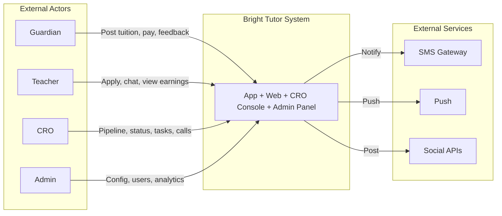

### 4.2 High-Level Component View

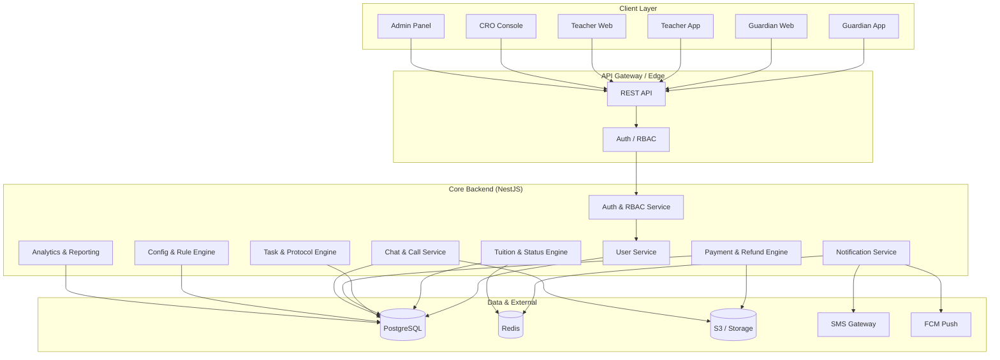

### 4.3 Logical Service Breakdown

| Service                   | Responsibility                                                          | Key Data                                                    |
| ------------------------- | ----------------------------------------------------------------------- | ----------------------------------------------------------- |
| **Auth & RBAC**           | Login (OTP), JWT issue/validate, role resolution, permission checks     | users, roles, sessions                                      |
| **User**                  | Guardian/Teacher/CRO/Admin profiles, stats, verification                | guardian_profiles, teacher_profiles                         |
| **Tuition & Status**      | Tuition CRUD, status lifecycle, transition validation, lock check       | tuitions, statuses, status_transitions, tuition_status_logs |
| **Task & Protocol**       | Task templates, task instances, due dates, completion/skip              | time_protocols, status_task_templates, tuition_tasks        |
| **Payment & Refund**      | Payments, refund applications, verification, approval                   | payments, payment_status, refunds                           |
| **Chat & Call**           | Threads, messages, tags, call records, outcomes                         | chat_threads, chat_messages, call_records                   |
| **Notification**          | In-app, push, SMS triggers from events                                  | queues, templates                                           |
| **Config & Rule**         | Status matrix, protocols, payment/refund rules, bonus slabs, lock rules | config_entries, bonus_slabs, system_locks                   |
| **Analytics & Reporting** | Aggregates, ribbon metrics, reports, exports                            | materialized views, report jobs                             |

### 4.4 Technology Stack & Justification

| Layer              | Choice                              | Why This Stack                                                                           |
| ------------------ | ----------------------------------- | ---------------------------------------------------------------------------------------- |
| **Web Frontend**   | React + Next.js + TypeScript        | SSR/SEO for marketing; shared types with backend; strong ecosystem.                      |
| **Web UI**         | Tailwind CSS + Ant Design / MUI     | Fast UI development; design system alignment with Figma.                                 |
| **State (Web)**    | React Query + Zustand/Redux Toolkit | Server state (React Query), minimal client state (Zustand).                              |
| **Mobile**         | React Native + Expo or Flutter      | Single team can do iOS/Android; shared logic with web via API.                           |
| **Backend**        | Node.js + NestJS                    | TypeScript end-to-end; modular structure; built-in guards for RBAC; enterprise patterns. |
| **API**            | REST (GraphQL optional later)       | Clear contracts; easy integration with mobile; tooling support.                          |
| **Auth**           | JWT + OTP                           | Stateless auth; mobile-friendly; OTP fits local UX. **MVP:** SMS provider (e.g. Teletalk) client-provided. |
| **Primary DB**     | PostgreSQL                          | ACID; JSONB for configs; strong relational model for status/task/payment.                |
| **Cache & Queues** | Redis                               | Caching ribbon/dashboards; BullMQ for jobs (notifications, reports).                     |
| **File Storage**   | S3-compatible (AWS S3 / MinIO)      | Call recordings, exports, attachments.                                                   |
| **Push**           | Firebase Cloud Messaging            | Reliable mobile push.                                                                    |
| **SMS**            | Client-provided (e.g. Teletalk)      | **MVP/Phase-01:** Client provides SMS provider API/credentials for OTP, reminders, alerts. |
| **Payment Gateway** | **SSLCommerz** (client-provided)   | **MVP/Phase-01:** Client provides credentials; online payment collection (7d/30d/partial). |
| **IP Telephony**  | **Client-provided IP call provider** | **MVP/Phase-01:** Inbound/outbound calls; caller ID passed to CRO Console for tuition create auto-populate. |
| **Containers**     | Docker                              | Consistent dev/prod.                                                                     |
| **Orchestration**  | Kubernetes or ECS                   | Scale and resilience.                                                                    |
| **CI/CD**          | GitHub Actions / GitLab CI          | Automated build, test, deploy.                                                           |
| **Monitoring**     | Prometheus + Grafana                | Metrics and dashboards.                                                                  |
| **Logging**        | ELK or CloudWatch                   | Centralized logs and audit trail.                                                        |

### 4.5 Data Flow (Conceptual)

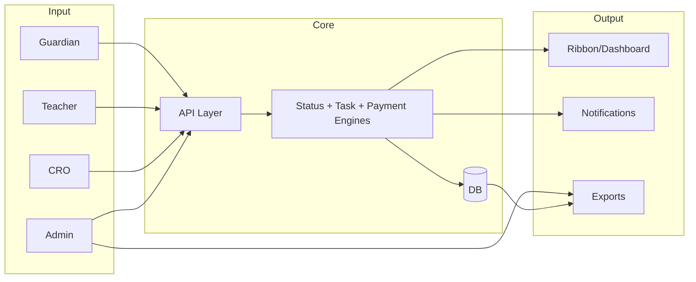

### 4.6 Deployment Architecture (Simplified)

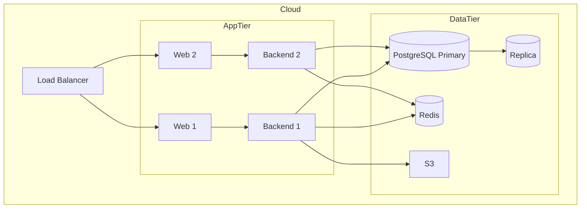

---

# PART D — MODULES & FEATURES (DEEP REQUIREMENTS)

📧 neexg7@gmail.com | 🌐 www.neexg.com | ☎ +880 1743586381

## 5. Module Breakdown

### 5.1 Module Overview Table

| #   | Module                                    | Owner Roles                   | Description                                                |
| --- | ----------------------------------------- | ----------------------------- | ---------------------------------------------------------- |
| M1  | Auth & Identity                           | All                           | OTP login, profile, primary/alternate phone.               |
| M2  | Guardian – Tuition Lifecycle              | Guardian                      | Post, list, detail, status timeline, decisions, feedback.  |
| M3  | Guardian – Interaction                    | Guardian                      | Shortlist view, chat, contact unlock.                      |
| M4  | Guardian – Payments & Refunds             | Guardian                      | Payment summary, pay 7d/30d/partial/clear, refund request. |
| M5  | Teacher – Profile & Verification          | Teacher                       | Profile CRUD, verification badge, metrics.                 |
| M6  | Teacher – Tuition Discovery & Application | Teacher                       | Browse, filter, apply, application status.                 |
| M7  | Teacher – Communication & Earnings        | Teacher                       | Chat, schedule, feedback, earnings, bonus.                 |
| M8  | CRO – Dashboard & Ribbon                  | CRO                           | Ribbon KPIs, today’s tasks, filters.                       |
| M9  | CRO – Tuition Cockpit                     | CRO                           | Per-tuition status, tasks, call log, profiles, actions.    |
| M10 | CRO – Communication & Outreach            | CRO                           | SMS, app, social post, shortlist, contact unlock.          |
| M11 | Admin – Configuration                     | Admin                         | Status, protocols, payment/refund rules, bonus, locks.     |
| M12 | Admin – User & Role Management            | Admin                         | CRUD users, verify, blacklist, roles.                      |
| M13 | Admin – Finance & Refunds                 | Admin                         | Payment view/correct, refund verify/approve.               |
| M14 | Admin – Analytics & Reporting             | Admin                         | Dashboards, KPIs, exports.                                 |
| M15 | Shared – Chat & Call                      | Guardian, Teacher, CRO, Admin | Threads, messages, tags, call records, outcomes.           |
| M16 | Shared – Notifications                    | All                           | In-app, push, SMS triggers.                                |

---

## 6. Guardian Domain – Detailed Requirements

### 6.1 Guardian – Auth & Profile

| Req ID    | Requirement                                                                                                                                    | Priority | Notes                             |
| --------- | ---------------------------------------------------------------------------------------------------------------------------------------------- | -------- | --------------------------------- |
| G-AUTH-01 | System shall allow sign-up/login with mobile number + OTP.                                                                                     | Must     | Primary + alternate numbers.      |
| G-AUTH-02 | System shall store and display primary and alternate phone numbers.                                                                            | Must     | Used for call-to-tuition mapping. |
| G-AUTH-03 | System shall show role-based home (Guardian dashboard) after login.                                                                            | Must     |                                   |
| G-AUTH-04 | Guardian shall be able to edit: full name, address (area, city, details).                                                                      | Must     |                                   |
| G-AUTH-05 | System shall display read-only Guardian stats: total tuitions posted, confirmed, running, trial count, average rating, trust tag (e.g. Green). | Must     | Backend/CRO maintained.           |
| G-AUTH-06 | System shall associate incoming calls from primary/alternate numbers to correct tuition.                                                       | Must     | Business rule from specs.         |

### 6.2 Guardian – Tuition Posting & Management

| Req ID   | Requirement                                                                                                                | Priority | Notes |
| -------- | -------------------------------------------------------------------------------------------------------------------------- | -------- | ----- |
| G-TUI-01 | System shall allow creating a tuition with: class, medium, subjects, budget range, area, schedule, special requirements.   | Must     |       |
| G-TUI-02 | System shall auto-generate a unique 9-digit Tuition ID.                                                                    | Must     |       |
| G-TUI-03 | Guardian shall see list of all own tuitions with status tag (chip with color/icon).                                        | Must     |       |
| G-TUI-04 | Guardian shall open tuition detail: full details, assigned teacher, schedule, status timeline, chat summary, payment card. | Must     |       |
| G-TUI-05 | System shall show history: status changes, call summary (no full recording), feedback entries.                             | Should   |       |

### 6.3 Guardian – Interaction, Decisions, Feedback

| Req ID   | Requirement                                                                                           | Priority | Notes |
| -------- | ----------------------------------------------------------------------------------------------------- | -------- | ----- |
| G-INT-01 | Guardian shall view shortlisted teachers per tuition (profile, rating, experience).                   | Must     |       |
| G-INT-02 | Guardian shall open chat with teacher only when status allows (e.g. Contact Shared).                  | Must     |       |
| G-INT-03 | Guardian shall see teacher contact (phone) only when unlocked by status.                              | Must     |       |
| G-INT-04 | Guardian shall be able to Confirm teacher, Request next teacher, or Cancel.                           | Must     |       |
| G-INT-05 | System shall trigger feedback flows after 2nd class (7-day protocol) and 3rd class (14-day protocol). | Must     |       |
| G-INT-06 | Guardian shall submit satisfaction feedback, continuation/change/terminate, star rating and comment.  | Must     |       |

### 6.4 Guardian – Payments & Refunds

| Req ID   | Requirement                                                                                                                         | Priority | Notes                                                 |
| -------- | ----------------------------------------------------------------------------------------------------------------------------------- | -------- | ----------------------------------------------------- |
| G-PAY-01 | Guardian shall see per-tuition: total due, paid, remaining, next due date, payment state (On Time / Due Soon / Overdue) with color. | Must     |                                                       |
| G-PAY-02 | Guardian shall be able to record/trigger Payment 7 Days, Payment 30 Days, Partial, Payment Clear.                                   | Must     | As per product flow (e.g. via bank then mark in app). |
| G-PAY-03 | Guardian shall see transaction history: Txn ID, amount, type, date/time.                                                            | Must     |                                                       |
| G-PAY-04 | Guardian shall submit refund application (tuition, amount, reason).                                                                 | Must     |                                                       |
| G-PAY-05 | System shall show refund status: Applied → Verifying (15d) → Clear → Successful/Rejected.                                           | Must     |                                                       |

---

## 7. Teacher Domain – Detailed Requirements

### 7.1 Teacher – Profile & Verification

| Req ID   | Requirement                                                                                                                         | Priority | Notes |
| -------- | ----------------------------------------------------------------------------------------------------------------------------------- | -------- | ----- |
| T-PRO-01 | Teacher shall sign up and log in with mobile + OTP.                                                                                 | Must     |       |
| T-PRO-02 | Teacher shall maintain profile: name, photo, education, subjects, classes, medium, preferred areas, experience.                     | Must     |       |
| T-PRO-03 | System shall show "Verified" badge after admin verification.                                                                        | Must     |       |
| T-PRO-04 | System shall display: confirmed count, running count, processing count, rating, payment history (Txn ID, date, amount), bonus band. | Must     |       |

### 7.2 Teacher – Discovery & Application

| Req ID   | Requirement                                                                                      | Priority | Notes |
| -------- | ------------------------------------------------------------------------------------------------ | -------- | ----- |
| T-DIS-01 | Teacher shall browse available tuitions with filters (subject, area, medium, budget).            | Must     |       |
| T-DIS-02 | Teacher shall view tuition detail (class, area, budget, schedule, notes).                        | Must     |       |
| T-DIS-03 | Teacher shall apply / show interest; system shall create application and expose to CRO pipeline. | Must     |       |
| T-DIS-04 | Teacher shall see application status: Applied, Shortlisted, Rejected, Confirmed, Running.        | Must     |       |

### 7.3 Teacher – Communication & Earnings

| Req ID   | Requirement                                                                             | Priority | Notes |
| -------- | --------------------------------------------------------------------------------------- | -------- | ----- |
| T-COM-01 | Teacher shall chat with guardian when status allows; mark important messages; see tags. | Must     |       |
| T-COM-02 | Teacher shall view upcoming classes/schedule.                                           | Must     |       |
| T-COM-03 | Teacher shall submit feedback at 2nd/3rd class checkpoints.                             | Must     |       |
| T-COM-04 | Teacher shall view per-tuition earnings, bonus (by slab), and full payment history.     | Must     |       |

---

## 8. CRO Domain – Detailed Requirements

### 8.1 CRO – Dashboard & Ribbon

| Req ID     | Requirement                                                                           | Priority | Notes      |
| ---------- | ------------------------------------------------------------------------------------- | -------- | ---------- |
| CRO-RIB-01 | System shall show Ribbon: Payment date over (count).                                  | Must     | Red/alert. |
| CRO-RIB-02 | System shall show: Pay 7 days within next 7 days (including today).                   | Must     |            |
| CRO-RIB-03 | System shall show: Those that exceeded payment dates (7d/30d).                        | Must     |            |
| CRO-RIB-04 | System shall show: Today’s tasks (all tasks due today for this CRO, with time slots). | Must     |            |
| CRO-RIB-05 | System shall show: Confirmed count, Assigned count, Pending exceed count.             | Must     |            |
| CRO-RIB-06 | System shall show Success Rate = Confirmed ÷ Assigned Tuitions (per CRO).             | Must     |            |
| CRO-RIB-07 | Ribbon metrics shall update from status and task engine (near real-time/cache).       | Must     |            |

### 8.1a CRO – Tuition Creation (Lead Capture from Inbound Call)

| Req ID        | Requirement                                                                                                                                 | Priority | Notes       |
| ------------- | ------------------------------------------------------------------------------------------------------------------------------------------- | -------- | ----------- |
| CRO-CREATE-01 | When Manager/CRO receives an inbound call via the **client-provided IP call provider**, the **caller number shall auto-populate** in the Tuition Create form (Guardian phone field). | Must     | MVP/Phase-01. |
| CRO-CREATE-02 | CRO/Manager shall confirm with guardian whether the number is **personal (primary)** or **optional (alternate)** and set Primary and Alternate phone accordingly. | Must     |             |
| CRO-CREATE-03 | After filling all required tuition info (student(s), class, subjects, location, schedule, salary, etc.), submission shall create the tuition in status **CREATED** and add it to the CRO pipeline. | Must     |             |

### 8.2 CRO – Tuition Cockpit

| Req ID     | Requirement                                                                                                                   | Priority | Notes |
| ---------- | ----------------------------------------------------------------------------------------------------------------------------- | -------- | ----- |
| CRO-COK-01 | CRO shall see Tuition ID, full tuition details, current status chip, allowed next statuses.                                   | Must     |       |
| CRO-COK-02 | CRO shall see next-task list (Guardian/Teacher/CRO) with due date, mandatory/skippable, complete/skip.                        | Must     |       |
| CRO-COK-03 | CRO shall add Special tasks (title, owner, priority, due).                                                                    | Should   |       |
| CRO-COK-04 | CRO shall play call recording and log outcome (No result, Will confirm, Meeting scheduled, Cancelled, Switch teacher, Other). | Must     |       |
| CRO-COK-05 | System shall attach time protocol to call outcome when configured (e.g. 15h, 7d, 30d).                                        | Must     |       |
| CRO-COK-06 | CRO shall see Guardian and Teacher mini-profiles (name, trust/rating, counts).                                                | Must     |       |
| CRO-COK-07 | CRO shall change status only when transition is allowed and mandatory tasks complete; system shall enforce lock.              | Must     |       |

### 8.3 CRO – Communication & Outreach

| Req ID     | Requirement                                                                                                                                          | Priority | Notes |
| ---------- | ---------------------------------------------------------------------------------------------------------------------------------------------------- | -------- | ----- |
| CRO-OUT-01 | CRO shall send tuition to teachers via: Mobile SMS, App Inbox, App push.                                                                             | Must     |       |
| CRO-OUT-02 | CRO shall post to Facebook & Instagram, WhatsApp, Telegram (template-based).                                                                         | Must     |       |
| CRO-OUT-03 | CRO shall shortlist teachers; send details/CV to guardian; call about CV; share Guardian number to Teacher and Teacher to Guardian (simultaneously). | Must     |       |
| CRO-OUT-04 | CRO shall unlock Guardian–Teacher chat and contact at allowed status.                                                                                | Must     |       |

---

## 9. Admin Domain – Detailed Requirements

### 9.1 Admin – Configuration

| Req ID     | Requirement                                                                                                                     | Priority | Notes                             |
| ---------- | ------------------------------------------------------------------------------------------------------------------------------- | -------- | --------------------------------- |
| ADM-CFG-01 | Admin shall define status list and transition matrix (from → to), with flags: mandatory, skippable, rollback allowed, lockable. | Must     |                                   |
| ADM-CFG-02 | Admin shall define time protocols (name, duration value, unit, max override).                                                   | Must     | e.g. 7d, 14d, 15h, 15d, 30d, 44d. |
| ADM-CFG-03 | Admin shall configure payment rules (Pay 7d, Pay 30d, partial, clear, grace, overdue logic).                                    | Must     |                                   |
| ADM-CFG-04 | Admin shall configure refund rules (eligibility, verification SLA, approver role).                                              | Must     |                                   |
| ADM-CFG-05 | Admin shall edit bonus slabs (min, max, bonus amount); system shall recalc teacher bonus.                                       | Must     |                                   |
| ADM-CFG-06 | Admin shall define lock rules (triggers, scope) and override unlock with reason (audit).                                        | Must     |                                   |

### 9.2 Admin – Users, Finance, Analytics

| Req ID     | Requirement                                                                                                                                 | Priority | Notes |
| ---------- | ------------------------------------------------------------------------------------------------------------------------------------------- | -------- | ----- |
| ADM-USR-01 | Admin shall create/edit/deactivate Guardians, Teachers, CROs, Admins; set roles.                                                            | Must     |       |
| ADM-USR-02 | Admin shall verify/reject Teacher profile (Verified badge).                                                                                 | Must     |       |
| ADM-FIN-01 | Admin shall view all payments (filter by tuition, guardian, teacher, CRO, status); correct with audit log.                                  | Must     |       |
| ADM-FIN-02 | Admin shall view refund applications, verify, approve/reject, mark Clear/Successful.                                                        | Must     |       |
| ADM-ANA-01 | Admin shall view dashboards: CRO success rate, teacher conversion, guardian metrics, payment/refund, operational (status, locked, overdue). | Must     |       |
| ADM-ANA-02 | Admin shall export reports (CSV/Excel) by date, CRO, area, subject, status.                                                                 | Must     |       |

---

# PART E — ENGINES & STATE MACHINES

## 10. Status Engine

### 10.1 Status List (Baseline – Configurable)

| Code                      | Name                      | Badge/Color | Terminal |
| ------------------------- | ------------------------- | ----------- | -------- |
| CREATED                   | Created                   | —           | No       |
| SHORTLISTED               | Shortlisted               | —           | No       |
| CONTACT_SHARED            | Guardian Contact Shared   | —           | No       |
| DEMO_SCHEDULED            | Demo Scheduled            | —           | No       |
| GUARDIAN_DECISION_PENDING | Guardian Decision Pending | —           | No       |
| CONFIRMED                 | Confirmed                 | —           | No       |
| PAYMENT_PENDING           | Payment Pending           | No          | No       |
| RUNNING                   | Running                   | —           | No       |
| COMPLETED                 | Completed                 | —           | Yes      |
| CANCELLED                 | Cancelled                 | —           | Yes      |

### 10.2 Status Transition Matrix (Example)

| From \ To        | SHORTLISTED | CONTACT_SHARED | DEMO_SCHEDULED | DECISION_PENDING | CONFIRMED | CANCELLED | RUNNING | COMPLETED |
| ---------------- | ----------- | -------------- | -------------- | ---------------- | --------- | --------- | ------- | --------- |
| CREATED          | ✅          | —              | —              | —                | —         | ✅        | —       | —         |
| SHORTLISTED      | —           | ✅             | ✅             | —                | —         | ✅        | —       | —         |
| CONTACT_SHARED   | ✅          | —              | ✅             | ✅               | —         | ✅        | —       | —         |
| DEMO_SCHEDULED   | ✅          | —              | —              | ✅               | —         | ✅        | —       | —         |
| DECISION_PENDING | ✅          | —              | —              | —                | ✅        | ✅        | —       | —         |
| CONFIRMED        | —           | —              | —              | —                | —         | ✅        | ✅      | —         |
| PAYMENT_PENDING  | —           | —              | —              | —                | —         | —         | ✅      | —         |
| RUNNING          | —           | —              | —              | —                | —         | ✅        | —       | ✅        |

_Actual matrix is configurable in Admin._

### 10.3 Status Lifecycle Flow (Mermaid)

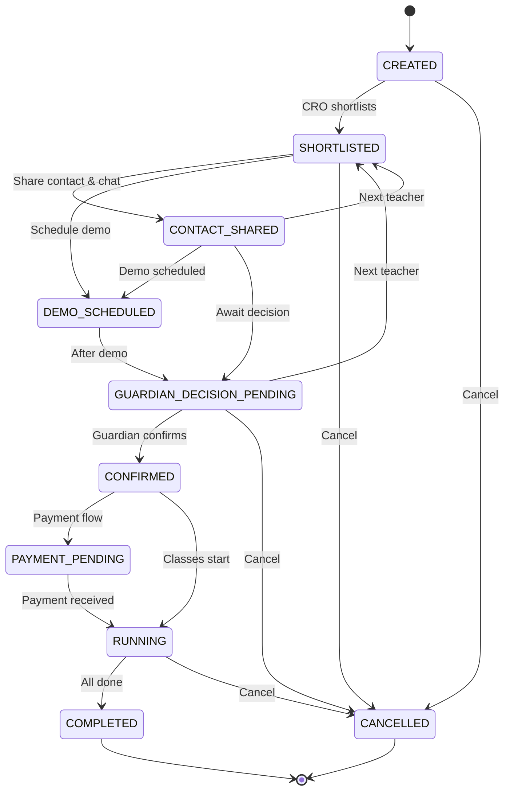

### 10.4 Status Advancement Rule

- Status **may advance** only when:
  1. All **mandatory** tasks for the current status are **completed** (or skipped where allowed).
  2. No **lock** is active on the tuition (or CRO/system scope) unless **Admin override** with reason.
  3. Transition is **allowed** in the configured matrix.

---

## 11. Next Task Engine

### 11.1 Task Template (Per Status)

| Attribute         | Description                              |
| ----------------- | ---------------------------------------- |
| status_id         | Link to status                           |
| owner_role        | Guardian / Teacher / CRO                 |
| name, description | Human-readable                           |
| protocol_id       | Default due (e.g. 7 days from trigger)   |
| mandatory         | If true, must complete to advance status |
| skippable         | If true, CRO/Admin can skip with reason  |
| order_index       | Display order                            |

### 11.2 Task Instance Lifecycle

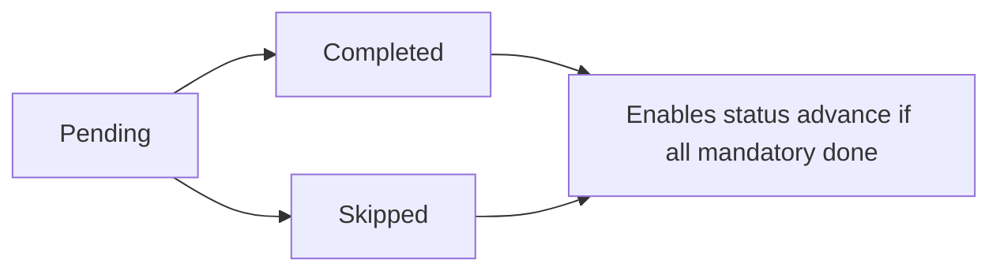

### 11.3 Protocol Catalogue (Baseline)

| Protocol Name      | Duration   | Use Case                    |
| ------------------ | ---------- | --------------------------- |
| RESPONSE_15H       | 15 hours   | App/SMS response deadline   |
| FEEDBACK_2ND_CLASS | 7 days     | After 2nd class feedback    |
| FEEDBACK_3RD_CLASS | 14 days    | After 3rd class feedback    |
| REFUND_VERIFY      | 15 days    | Refund verification         |
| PAYMENT_7D         | 7–15 days  | Pay 7 days window           |
| PAYMENT_30D        | 30–44 days | Pay 30 days / EOM           |
| GUARDIAN_DECIDE    | 30 days    | Guardian will confirm later |

---

## 12. Payment & Refund Engine

### 12.1 Payment Types

| Type          | Description      | Typical Window              |
| ------------- | ---------------- | --------------------------- |
| Pay 7 Days    | First instalment | Day 7–15 from start         |
| Pay 30 Days   | Monthly / EOM    | e.g. 44 days from start     |
| Partial       | Custom amount    | Custom due                  |
| Payment Clear | All dues cleared | When total_paid ≥ total_due |

### 12.2 Payment State

| State    | Condition                   | UI Color |
| -------- | --------------------------- | -------- |
| ON_TIME  | due_date > today            | Green    |
| DUE_SOON | due_date within next 7 days | Amber    |
| OVERDUE  | due_date < today            | Red      |

### 12.3 Refund State Machine

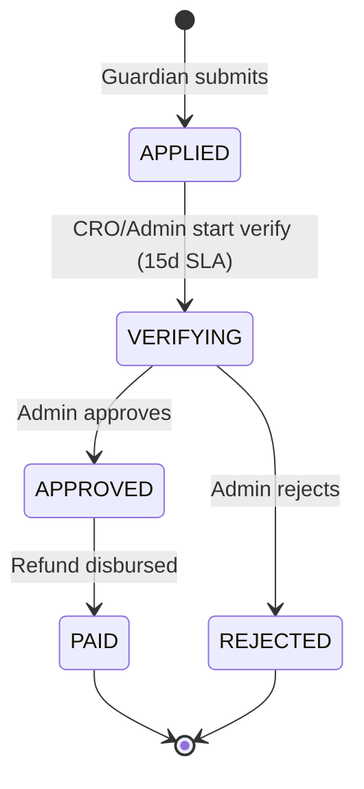

### 12.4 Bonus Slabs (Baseline – Configurable)

| Tuition Amount (BDT) | Bonus (BDT) |
| -------------------- | ----------- |
| 500 – 999            | 250         |
| 1,000 – 2,000        | 300         |
| 2,000 – 3,000        | 350         |
| 3,000 – 5,000        | 400         |
| 5,000 – 7,000        | 500         |
| 7,000 – 9,000        | 600         |
| 9,000 – 12,000       | 800         |
| 12,000+              | 1,000       |

---

# PART F — USER STORIES & USER JOURNEYS

📧 neexg7@gmail.com | 🌐 www.neexg.com | ☎ +880 1743586381

## 13. User Stories (Structured)

### 13.1 Guardian

| ID      | Story                                                                                                                                              | Acceptance                                                       |
| ------- | -------------------------------------------------------------------------------------------------------------------------------------------------- | ---------------------------------------------------------------- |
| US-G-01 | As a **Guardian**, I want to **register with primary and alternate phone** so that **all my calls are linked to the correct tuition**.             | OTP login; both numbers stored and used for call mapping.        |
| US-G-02 | As a **Guardian**, I want to **post a tuition** with class, subjects, budget, area, schedule so that **Bright Tutor can find a matching teacher**. | 9-digit ID generated; tuition appears in CRO pipeline.           |
| US-G-03 | As a **Guardian**, I want to **see shortlisted teachers** with profile and rating so that **I can choose confidently**.                            | Shortlist view per tuition with cards.                           |
| US-G-04 | As a **Guardian**, I want to **chat and call the teacher** only after Bright Tutor unlocks it so that **I can conduct a demo safely**.             | Chat/contact visible only at allowed status.                     |
| US-G-05 | As a **Guardian**, I want to **confirm, change, or cancel the teacher** so that **I stay in control**.                                             | Confirm / Next teacher / Cancel actions available.               |
| US-G-06 | As a **Guardian**, I want to **pay in flexible ways** (7 days / 30 days / partial) so that **I can manage cash flow**.                             | Payment types and history visible and actionable.                |
| US-G-07 | As a **Guardian**, I want to **request a refund and track status** so that **I feel protected**.                                                   | Refund form and status (Applied → Verifying → Clear/Successful). |

### 13.2 Teacher

| ID      | Story                                                                                                      | Acceptance                                         |
| ------- | ---------------------------------------------------------------------------------------------------------- | -------------------------------------------------- |
| US-T-01 | As a **Teacher**, I want to **create a verified profile** so that **guardians and CROs trust me**.         | Profile CRUD; Verified badge after admin approval. |
| US-T-02 | As a **Teacher**, I want to **see only relevant tuitions** (area, subject) so that **I don’t waste time**. | Filtered list and apply.                           |
| US-T-03 | As a **Teacher**, I want to **know if I am shortlisted or rejected** so that **I understand my pipeline**. | Application status visible.                        |
| US-T-04 | As a **Teacher**, I want to **chat with the guardian** only when allowed so that **privacy is respected**. | Chat enabled by status.                            |
| US-T-05 | As a **Teacher**, I want to **see my earnings and bonus** clearly so that **I can plan**.                  | Per-tuition earnings and bonus band visible.       |

### 13.3 CRO

| ID        | Story                                                                                                                           | Acceptance                                   |
| --------- | ------------------------------------------------------------------------------------------------------------------------------- | -------------------------------------------- |
| US-CRO-01 | As a **CRO**, I want a **ribbon with overdue, today’s tasks, success rate** so that **I can prioritize my day**.                | Ribbon blocks as specified.                  |
| US-CRO-02 | As a **CRO**, I want a **per-tuition cockpit** (status, tasks, call, profiles) so that **I can act without switching screens**. | All sections on one screen.                  |
| US-CRO-03 | As a **CRO**, I want to **log call outcomes** that auto-create next tasks with SLA so that **follow-ups are never missed**.     | Outcome dropdown and protocol attachment.    |
| US-CRO-04 | As a **CRO**, I want to **broadcast tuitions** (SMS, app, social) so that **I can build a shortlist fast**.                     | Message to teachers and social post actions. |
| US-CRO-05 | As a **CRO**, I want to **see my success rate** so that **I can improve**.                                                      | Success Rate = Confirmed ÷ Assigned.         |

### 13.4 Admin

| ID      | Story                                                                                                                           | Acceptance                           |
| ------- | ------------------------------------------------------------------------------------------------------------------------------- | ------------------------------------ |
| US-A-01 | As an **Admin**, I want to **configure statuses and transitions** in the UI so that **business rules can change without code**. | Status matrix configurable.          |
| US-A-02 | As an **Admin**, I want to **set time protocols and payment/refund rules** so that **SLA and finance are consistent**.          | Protocols and rules editable.        |
| US-A-03 | As an **Admin**, I want to **set lock rules and override with reason** so that **overload is controlled and auditable**.        | Lock config and override with audit. |
| US-A-04 | As an **Admin**, I want to **see full analytics and export** so that **I can report and improve**.                              | Dashboards and CSV/Excel export.     |

---

## 14. User Journeys & Flows (with Diagrams)

### 14.1 End-to-End Tuition Lifecycle (Guardian → CRO → Teacher → Payment)

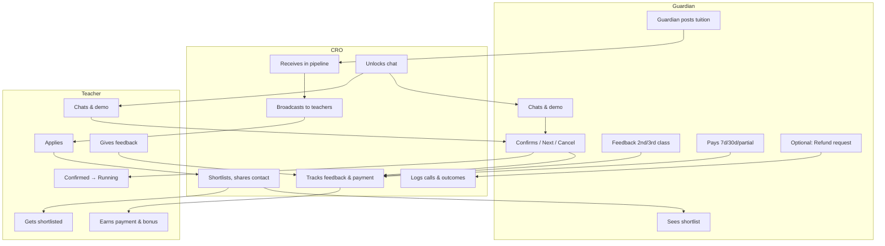

### 14.2 Guardian Journey – Step-by-Step

| Step | Actor    | Action                                                      | System Response                                      |
| ---- | -------- | ----------------------------------------------------------- | ---------------------------------------------------- |
| 0a   | Guardian | **Alternative:** Calls business number                      | CRO receives via IP; caller number auto-populates in Tuition Create; CRO sets primary/optional, fills form, submits (§1.3). |
| 1    | Guardian | Opens app, enters phone, requests OTP                       | OTP sent; login on verify                            |
| 2    | Guardian | Fills tuition form (class, subject, budget, area, schedule) | Tuition created; 9-digit ID; appears in CRO pipeline |
| 3    | Guardian | Views "My Tuitions"                                         | List with status chips                               |
| 4    | CRO      | Shortlists teachers, shares with guardian                   | Guardian sees shortlist                              |
| 5    | Guardian | Opens teacher cards, later chat (when unlocked)             | Chat and contact visible at allowed status           |
| 6    | Guardian | Attends demo                                                | —                                                    |
| 7    | Guardian | Clicks Confirm / Next teacher / Cancel                      | Status updated; if Confirm → Running                 |
| 8    | Guardian | Receives feedback prompt (after 2nd/3rd class)              | Submits feedback within 7d/14d                       |
| 9    | Guardian | Opens payment card, pays (7d/30d/partial)                   | Payment recorded; history updated                    |
| 10   | Guardian | Optionally requests refund                                  | Refund APPLIED; status trackable                     |

### 14.3 Teacher Application → Shortlist → Confirm (Sequence)

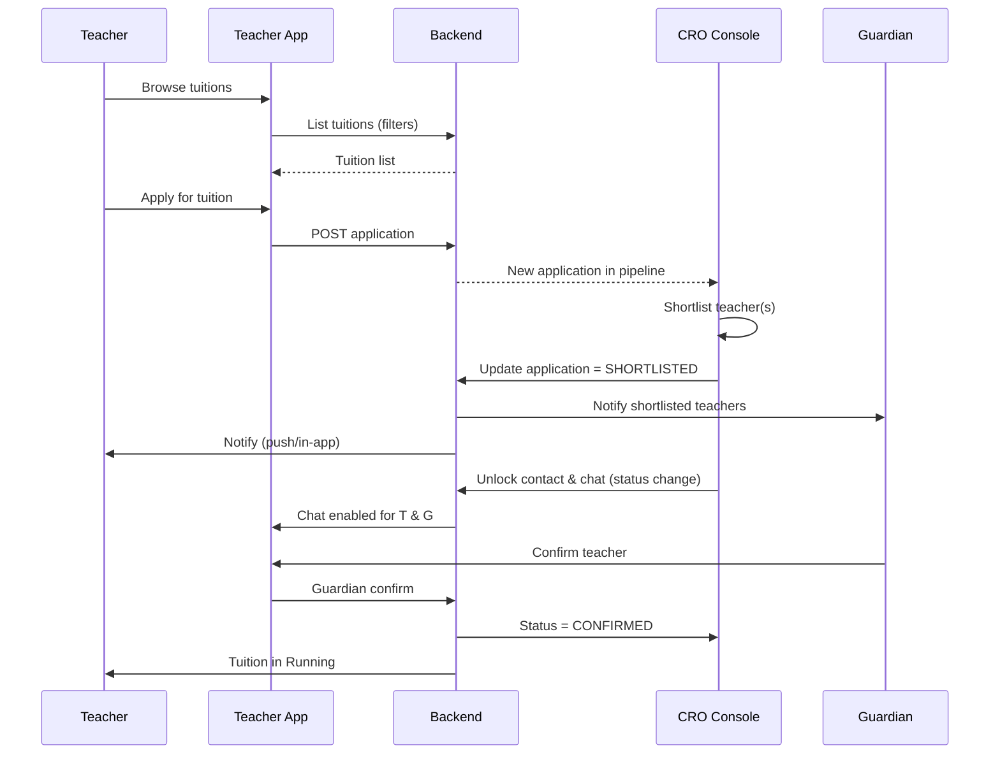

### 14.4 CRO Daily Flow – Task & Status (Sequence)

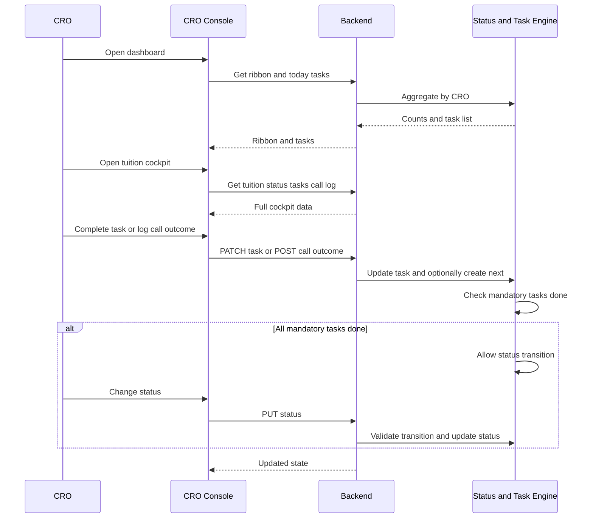

### 14.5 Payment & Refund Flow (Sequence)

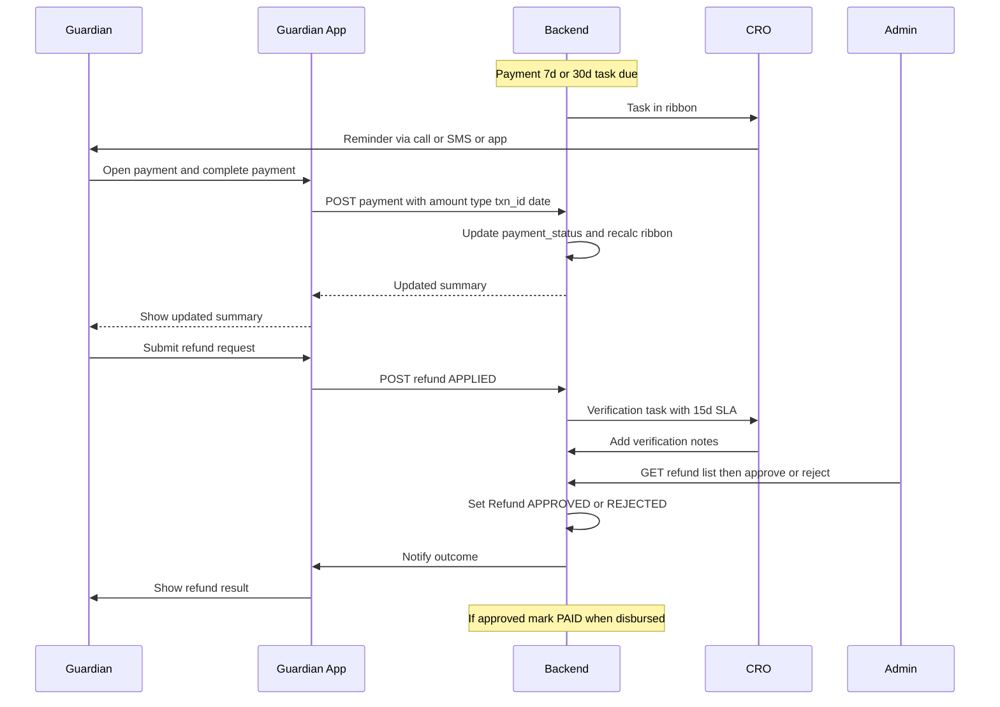

### 14.6 Full Tuition Lifecycle (Flowchart)

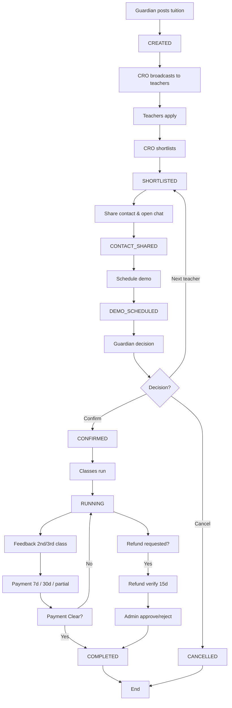

---

# PART G — NON-FUNCTIONAL & OPERATIONS

📧 neexg7@gmail.com | 🌐 www.neexg.com | ☎ +880 1743586381

## 15. Non-Functional Requirements

### 15.1 Performance

| ID     | Requirement                    | Target                                |
| ------ | ------------------------------ | ------------------------------------- |
| NFR-P1 | API response time (p95)        | < 300 ms under normal load            |
| NFR-P2 | Status / ribbon update latency | Within seconds (event-driven + cache) |
| NFR-P3 | Concurrent users               | Scale to 100K+ users                  |
| NFR-P4 | Active tuitions                | Tens of thousands                     |

### 15.2 Security

| ID     | Requirement                                                           |
| ------ | --------------------------------------------------------------------- |
| NFR-S1 | RBAC enforced at API and UI.                                          |
| NFR-S2 | JWT-based authentication; token expiry and refresh.                   |
| NFR-S3 | Payment and call data access restricted by role.                      |
| NFR-S4 | Sensitive data encrypted in transit (TLS) and at rest where required. |

### 15.3 Reliability & Availability

| ID     | Requirement                                      |
| ------ | ------------------------------------------------ |
| NFR-R1 | Target uptime ≥ 99.5%.                           |
| NFR-R2 | Database backups and recovery procedure defined. |
| NFR-R3 | Graceful degradation under load (no data loss).  |

### 15.4 Audit & Compliance

| ID     | Requirement                                                                       |
| ------ | --------------------------------------------------------------------------------- |
| NFR-A1 | Audit log: status changes, payment/refund actions, config changes, lock override. |
| NFR-A2 | Logs retained per retention policy; tamper-evident where required.                |

---

## 16. Delivery Roadmap

### 16.1 Phase Overview

| Phase        | Duration   | Focus                                                                                 |
| ------------ | ---------- | ------------------------------------------------------------------------------------- |
| **Phase 0**  | 2–3 weeks  | BRD/PRD sign-off; status matrix & RBAC freeze; design alignment                       |
| **Phase 1**  | 8–12 weeks | Core lifecycle: Guardian/Teacher apps, CRO console, status+task engine, basic payment |
| **Phase 2**  | 6–8 weeks  | Payment/refund engine, bonus, lock, ribbon, analytics                                 |
| **Phase 3**  | 4–6 weeks  | Hardening, security audit, UAT, go-live readiness                                     |
| **Phase 4+** | Future     | AI matching, CRM, attendance, dynamic pricing                                         |

### 16.2 Phase 1 – Feature vs Module

| Module                  | Phase 1 Deliverable                                                               |
| ----------------------- | --------------------------------------------------------------------------------- |
| M1 Auth                 | OTP login, profile (Guardian/Teacher/CRO/Admin)                                   |
| M2 Guardian Tuition     | Post, list, detail, status timeline                                               |
| M3 Guardian Interaction | Shortlist view, chat (unlock), contact                                            |
| M4 Guardian Payment     | Summary, pay 7d/30d/partial/clear, refund request                                 |
| M5–M7 Teacher           | Profile, apply, shortlist status, chat, earnings, bonus view                      |
| M8–M10 CRO              | Ribbon, cockpit, status/task, call log, SMS/app/social, shortlist, unlock         |
| M11–M14 Admin           | Basic config (status, protocols), user CRUD, payment/refund view, basic analytics |
| M15–M16 Shared          | Chat, call metadata, in-app + push + SMS triggers                                 |

---

## 17. Acceptance Criteria (Traceability)

### 17.1 Summary Table

| #    | Criterion                                                                           | Verifiable By          |
| ---- | ----------------------------------------------------------------------------------- | ---------------------- |
| AC-1 | All roles (Guardian, Teacher, CRO, Admin) log in and see only authorized modules.   | RBAC test matrix       |
| AC-2 | Status transitions follow configured matrix; illegal transitions rejected.          | Status engine tests    |
| AC-3 | Mandatory tasks block status advance until completed/skipped.                       | Task engine tests      |
| AC-4 | Payment types (7d, 30d, partial, clear) work; overdue and ribbon reflect correctly. | Payment + ribbon tests |
| AC-5 | Refund flow: Applied → Verifying → Approve/Reject → Clear/Successful.               | Refund flow E2E        |
| AC-6 | Ribbon shows correct counts (confirmed, pending exceed, success rate).              | Dashboard tests        |
| AC-7 | Admin config changes (protocols, bonus, status) apply without code deploy.          | Config tests           |
| AC-8 | Critical actions (status, payment, refund, config, lock) are audit logged.          | Audit log checks       |

---

# PART H — APPENDICES

📧 neexg7@gmail.com | 🌐 www.neexg.com | ☎ +880 1743586381

## Appendix A – Glossary

| Term              | Definition                                                                                 |
| ----------------- | ------------------------------------------------------------------------------------------ |
| **CRO**           | Customer / Conversion / Relationship Officer; operations role owning tuition pipeline.     |
| **Tuition**       | A tutoring request posted by a Guardian (one student, one or more subjects).               |
| **Status**        | Current stage of a tuition in the lifecycle (e.g. CREATED, SHORTLISTED, RUNNING).          |
| **Next Task**     | Action item tied to a status (Guardian/Teacher/CRO) with due date and mandatory/skippable. |
| **Time Protocol** | SLA duration (e.g. 7 days for feedback) used to set task due dates.                        |
| **Ribbon**        | CRO dashboard strip of KPIs (overdue, today’s tasks, success rate, etc.).                  |
| **Bonus Slab**    | Tuition amount range → teacher bonus amount (configurable).                                |
| **Lock**          | System or admin restriction preventing certain operations (e.g. new assignments).          |

## Appendix B – Document References

- Figma: Bright Tutor App (Guardian/Teacher flows).
- Figma: Bright Tutor Admin Panel (CRO + Admin).
- Internal: Work.pdf (CRO process, tuition lifecycle).
- Internal: Documentation.pdf (badge, status, payment, bonus).
- Internal: Notes, সেকশন (status, chat, payment, bonus, task sequencing).
- Prior: Master Scope v1.0 draft.

## Appendix C – Revision History

| Version | Date       | Author | Changes                                                                                                                                                    |
| ------- | ---------- | ------ | ---------------------------------------------------------------------------------------------------------------------------------------------------------- |
| 1.0     | —          | —      | Initial draft (client-provided).                                                                                                                           |
| 2.0     | March 2026 | —      | Restructure; RBAC tables; architecture & stack justification; modules & requirements; user stories; journeys; diagrams; NFR; roadmap; acceptance criteria. |
| 2.1     | March 2026 | —      | MVP/Phase-01: client-provided IP call provider, SSLCommerz, SMS (e.g. Teletalk); lead capture flow (inbound call → auto-populate guardian number → primary/optional → tuition create); CRO requirements CRO-CREATE-01/02/03; lead capture sequence diagram; tech stack table updated; sequence diagram syntax fixes (14.4, 14.5). |

---

**End of Master Scope Document**

_This document is the single source of truth for the Bright Tutor ecosystem and is intended for client approval and delivery team execution._
